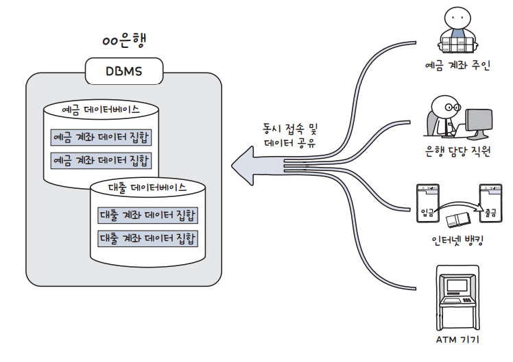

# 데이터베이스 매니지먼트 시스템

## DBMS 개요

> 데이터베이스라는 데이터의 집합을 만들고, 저장 및 관리할 수 있는 기능들을 제공하는 응용 프로그램의 총칭.       
데이터의 관리에 특화된 프로그램들이라고 생각하면 편하다. 종류에 따라 DataBase Server까지 지원하기도 한다.

>

 

## DBMS 개념

> 데이터베이스를 데이터의 집합이라고 정의한다면         
이런 데이터베이스를 관리하고 운영하는 소프트웨어를 DBMS(Database Management System)라고 합니다.     
다양한 데이터가 저장되어 있는 데이터베이스는 여러 명의 사용자나 응용 프로그램과 공유하고 동시에 접근이 가능해야 합니다.

 

## DBMS 기능

>중복 제어: 동일한 데이터가 여러 위치에 중복 저장되는 현상을 방지한다.      
데이터가 중복되면, 저장 공간이 낭비되고 데이터의 일관성이 깨질 수 있다.     

>접근 통제: DBMS는 사용자마다 다양한 권한을 부여할 수 있으며     
 권한에 따라 데이터에 대한 접근을 제어할 수 있다.       
    
>인터페이스 제공 : DBMS는 사용자에게 SQL 및 CLI, GUI 등 다양한 인터페이스를 제공한다.    

>관계 표현: 서로 다른 데이터간의 다양한 관계를 표현할 수 있는 기능을 제공한다.   

>샤딩/파티셔닝: 구조 최적화를 위해 작은 단위로 쪼개는 기능을 제공한다.   

>무결성 제약 조건: 무결성에 관한 제약 조건을 정의/검사하는 기능을 제공한다.        
 데이터베이스는 반드시 무결성 제약조건을 통과한 데이터만을 저장하고 있어야 한다.    
    
>백업 : 인 메모리 데이터베이스의 경우 속도를 위해 이 기능을 포기했다.    
 전원이 나가면 저장된 자료들이 날아가기 때문에 별도의 데이터베이스에 백업을 해야 한다.

  
