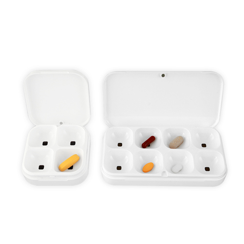
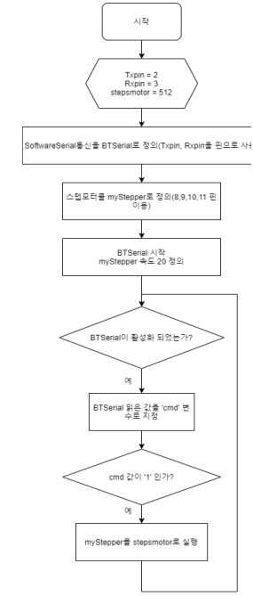
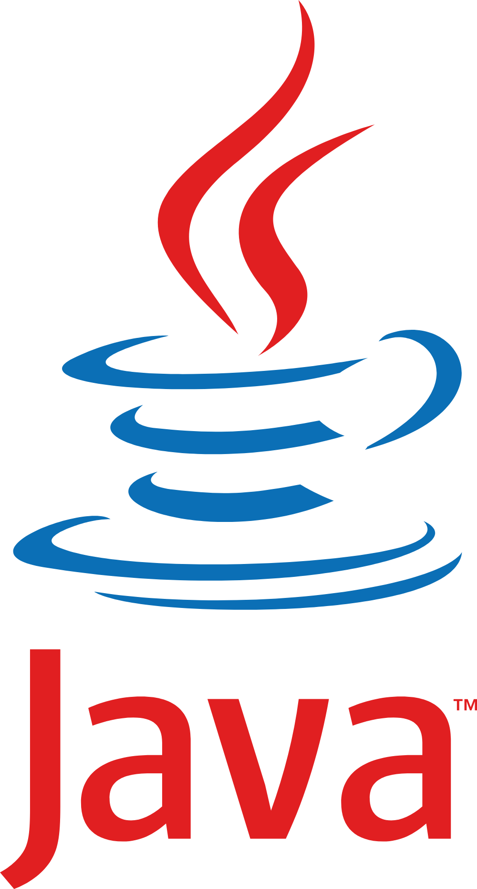
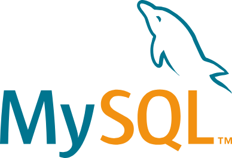

# 자기소개 
 

## 인적사항

> 이름 : 김신중         
 생년월일 : 2002년 11월 19일            
 학교 : 서일대학교 소프트웨어공학과 3학년 재학중            
 이메일 : skan39621@gmail.com

 

## 개발철학

> 포기를 모르는 백엔드 개발자의 개발 철학, 제 이야기를 들어보시겠습니까?            
저는 문제 해결에 푹 빠져 사는 백엔드 개발자입니다. 제 개발 철학은 딱 하나, "포기란 없습니다!" 입니다.       
"안 되는 건 없습니다. 어떻게든 되게 만들면 됩니다." 코딩은 매일매일 문제와 씨름하는 일상입니다.         
에러나 버그는 당연한 과정이고요. 좌절하기보단 오히려 '어떻게 해결할까?' 하면서 두근거리는 마음으로 달려듭니다.      
막히는 부분이 있으면 구글링은 기본, 스택 오버플로우, 공식 문서, 심지어 옆자리 동료까지 닥치는 대로 활용해서 답을 찾아냅니다.        
물론 단순히 복붙하는 건 딱 질색입니다.          
근본적인 원리를 파악해서 제 것으로 만들어야 속이 시원합니다.        

 

## 진행한 프로젝트

**스마트 알약통** (텀 프로젝트)

> 프로젝트명 : 스마트 알약통    
    >개발인원 : 4명     
     개발기간 : 2024.09 ~ 2024.12       
     기여 : 소프트웨어 설계, 알고리즘 구현

**냉장 GO** (캡스톤 디자인)

> 프로젝트명 : 냉장 GO      
    > 개발인원 : 4명      
      개발기간 : 2025.03 ~ 2025.12      
      기여 : DB 연동, 소프트웨어 설계, 알고리즘 구현      
 

## 기술 스텍

**BackEnd**    

       

> Java , SpringBoot

**DataBase**        

 

> Mysql

**Tools**

  

>Eclipse , VisualStudio

## 자격증

> 컴퓨터활용능력 1급        
 정보처리기능사
